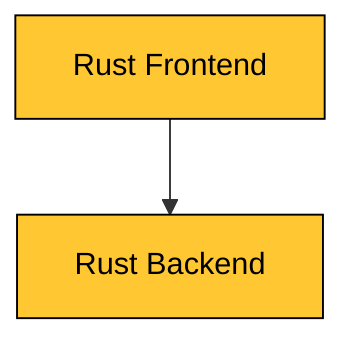
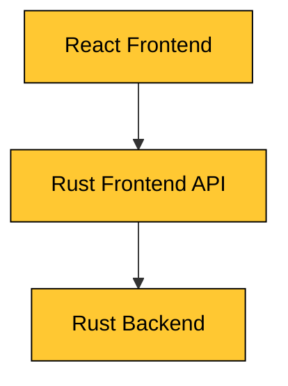

# Rust Sandbox

This repository contains sandbox projects to showcase features of the [Rust framework](https://www.rust-lang.org).

All examples are written in [Rust](https://www.rust-lang.org) and built using [Cargo](https://www.rust-lang.org).

## Examples
Read details about the examples in their respective project roots.

* [Warp REST API](./apps/rust-warp-api-rest)

## Architecture
...

The examples typically consist of a `Frontend` and a `Backend` application.

If the frontend is a JavaScript application then there is often also a `Frontend API` application.

## Use case
Most examples implement a "hello world" style logic that returns a greeting message when the user inputs a name.

* A user inputs the name "John" and clicks "Submit"
* The system generates a greeting "Hello John!" back to the user
